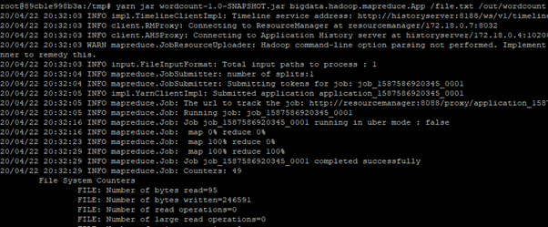
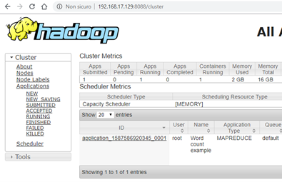
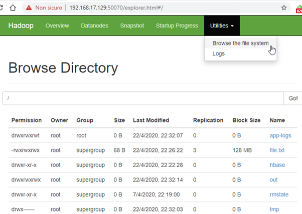
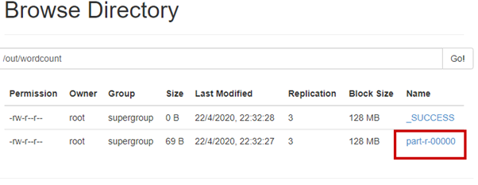
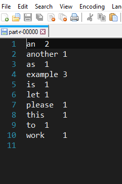

## Wordcount-MapReduce\_YARN

This Maven-based example implements the classic wordcount example from Hadoop
# 1

The example:

- Implement the runner class as bigdata.hadoop.mapreduce.App
- The runner takes as input 2 parameters:
  - the input file (or folder)
  - an output folder where to store the job results
- Based on the input file, the job provides at the end some text files where words are being followed by their occurrences.

### 0 - Requirements

- Maven 3.3.x
- Java JDK 8
- A Hadoop Yarn installation (we are using the one described during lesson lab
# 2
 and based on Docker)

### 1 - Project build

Download and unpack the project zip. From the terminal move inside the unpacked folder and run the maven compile command:

    mvn clean package

The output should be a target folder with a jar file named wordcount-1.0-SNAPSHOT.jar

### 2 - Upload file and prepare the data

You should copy the jar file into the VM image and then inside the container. Supposing your VM has IP 192.68.17.129 (user ubuntu) you can upload the jar file into /tmp via ssh from terminal as follow:

    scp wordcount-1.0-SNAPSHOT.jar ubuntu@192.168.17.129:/tmp

Then login inside the VM and copy the jar file into the namode container (the node that has the yarn libraries and commands already installed).

move to /tmp and use this command to copy the jar file inside the container:

    docker cp wordcount-1.0-SNAPSHOT.jar namenode:/tmp

Login into the namenode container:

    docker exec -ti namenode bash

Generate some text and upload into Hadoop:

    echo "this is an example please let another example to work as an example" \> file.txt

    hadoop fs -copyFromLocal file.txt /file.txt

### 3 - Job execution

Supposing you are inside the docker container named namenode and you copied the jar file under /tmp within the container, then use the following command to execute the job:

    yarn jar wordcount-1.0-SNAPSHOT.jar bigdata.hadoop.mapreduce.App /file.txt /out

Check Yarn interface while it is running:

When the job is completed you can check the hdfs file system ([http://192.168.17.129:50070/explorer.html#/](http://192.168.17.129:50070/explorer.html#/)):

Then you can download the output files:

When you are downloading the file, the url will contain the container name; replace it with VM ip from:

to

[http://192.168.17.129:50075/webhdfs/](http://192.168.17.129:50075/webhdfs/v1/out/wordcount/part-r-00000?op=OPEN&namenoderpcaddress=namenode:9000&offset=0)….

The final results will be the following file:

[1](#sdfootnote1anc)[https://hadoop.apache.org/docs/r1.2.1/mapred\_tutorial.html](https://hadoop.apache.org/docs/r1.2.1/mapred_tutorial.html)

[2](#sdfootnote2anc)[https://drive.google.com/file/d/19ExMesOVtTtHLEmqTh\_ptrW-OQLWdqrT/view?usp=sharing](https://drive.google.com/file/d/19ExMesOVtTtHLEmqTh_ptrW-OQLWdqrT/view?usp=sharing)